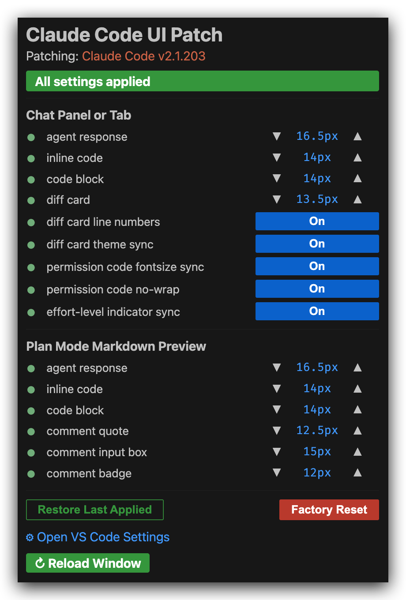
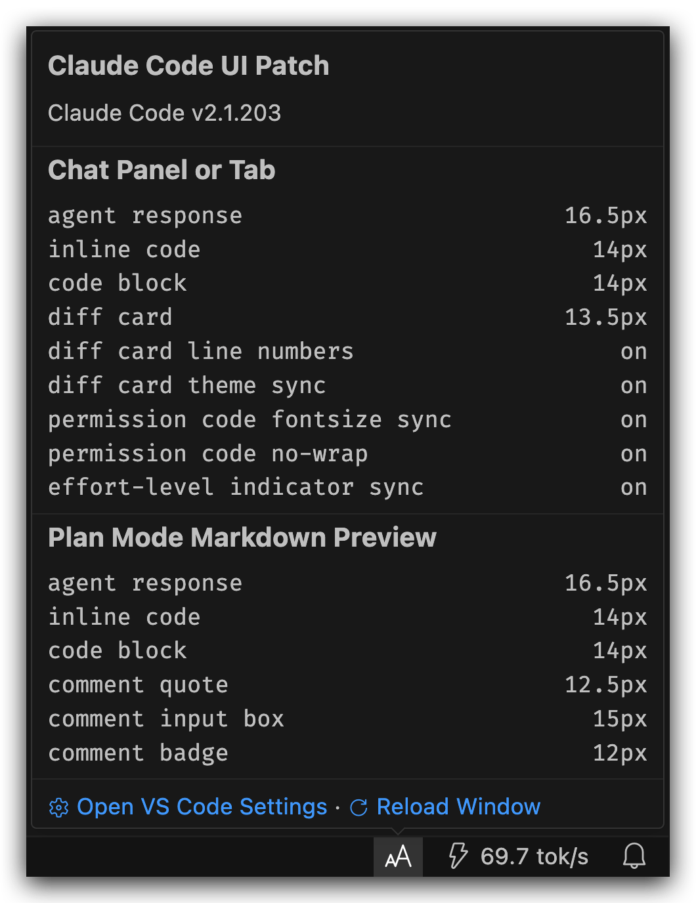

# Claude Code UI Patch

Patch Claude Code VS Code extension UI to provide finegrained settings for various UI details (font sizes, code blocks, diff cards, and more).

## Supported Versions

| Claude Code | UI Patch |
| ----------- | -------- |
| 2.1.201+    | 1.1.x    |

## Every Knob, One Panel

|                Configuration Panel                |                     Status Bar Item                     |
| :-----------------------------------------------: | :-----------------------------------------------------: |
|  |         |
|     Adjust the knobs, then **Reload Window**      | Hover the `aA` to show summary, and click to open panel |

1. Open the configuration panel  
   Press `Cmd+Shift+P` / `Ctrl+Shift+P` (or `F1`) to open the Command Palette, then run **Claude Code UI Patch: Open Panel**. Or alternatively, click the `aA` item at the far right of the status bar.
2. Modify the settings.  
   The yellow light in front of the item and the yellow highlight of the status bar icon will indicate that a **Reload Window** is needed in order for the configurations to fully apply.
3. **Reload Window**  
   Click it at the bottom of the panel for the changes to take effect. Or alternatively, open the Command Palette, then run **Developer: Reload Window**.
4. Repeat until satisfied.

## What This Extension Patches

Settings live under the `claudeCodeUiPatch.*` namespace (prefix omitted below) and each defaults to Claude Code's native value. The tree shows every knob, what it targets, and what scales with what: an indented child follows its parent until you give it a value.

```text
chat.fontSize & chat.fontFamily        # native VS Code settings, shared by every chat extension
   │                                   # therefore, this patch does NOT override them
   ├── input box
   ├── interface chrome (buttons, headers, token counts)
   ├── your messages + attachment chips (e.g. image.png)
   └── other chat extensions (Codex, Copilot, ...)

Chat Panel and Tab                     # agent messages only
   ├── chatHistoryFontSize             # agent message text, 0 -> follows chat.fontSize
   ├── chatHistoryFontFamily           # agent message font, empty -> native UI font
   ├── chatCodeBlockFontSize           # fenced code blocks
   │      └── chatCodeInlineFontSize   # inline code, 0 -> follows chatCodeBlockFontSize
   └── diff cards                      # Edit / MultiEdit tool cards + expand modal
          ├── chatDiffCardFontSize     # diff code size
          ├── chatDiffCardLineNumbers  # +/- gutter line numbers if On
          └── chatDiffCardThemeSync    # follow VS Code light/dark theme if On

Plan Mode Markdown Preview
   ├── planPreviewFontSize             # preview text (headings scale with it)
   ├── planPreviewFontFamily           # preview font, empty -> native
   ├── planPreviewCodeBlockFontSize    # fenced code blocks
   │      └── planPreviewCodeInlineFontSize      # 0 -> follows planPreviewCodeBlockFontSize
   └── select-and-comment UI
          ├── planPreviewCommentInputFontSize    # comment box text
          ├── planPreviewCommentInputRows        # comment box height in rows, 0 -> native
          ├── planPreviewCommentQuoteFontSize    # selected-text quote
          └── planPreviewCommentBadgeFontSize    # comment badge (14px circle, keep <= 12)

Behavior
   ├── chatInputMaxLines               # input box: grow to N lines + keep bottom gap, 0 -> native
   ├── chatShowMoreAndLessAlign        # "left" / "right", empty "" -> native
   ├── chatPermissionCodeMatchChatCodeBlock      # chatCodeBlockFontSize (On) or chat.fontSize (Off)
   ├── chatPermissionCodeNoWrap        # permission cmd: no-wrap + h-scroll (On) or wrap (Off)
   └── effortSyncFix                   # push persisted effort level to a reloaded session if On

Unified codeFontFamily                 # code font only; IN/OUT block, chrome, diff cards stay native
   ├── chat panel and tab  (fenced code + inline code)
   ├── plan mode preview   (fenced code + inline code)
   └── permission prompt   (command block)
```

## Using This UI Patch

- **Panel controls:** sizes use `▼`/`▲`, toggles an On/Off switch, and each row's sync dot shows green (in effect) or yellow (reload needed).
- **Direct edits:** Font families, the input-box line cap, comment-box rows, and the "Show more/less" button alignment have no panel control, set them in VS Code Settings via direct edits. `claudeCodeUiPatch.*` settings apply upon a window reload. Example:

  ```json
  {
    // These settings affect ALL native chats, including Claude Code, Codex, Copilot, etc.
    // Therefore, UI Patch does not touch them
    // "chat.fontFamily": "default",
    // "chat.fontSize": 15,

    // UI Patch font size settings in a unified namespace `claudeCodeUiPatch`
    "claudeCodeUiPatch.chatCodeBlockFontSize": 14,
    "claudeCodeUiPatch.chatCodeInlineFontSize": 14,
    "claudeCodeUiPatch.chatDiffCardFontSize": 13.5,
    "claudeCodeUiPatch.chatHistoryFontSize": 15.75,
    "claudeCodeUiPatch.chatInputMaxLines": 20,
    "claudeCodeUiPatch.planPreviewFontSize": 15.75,
    "claudeCodeUiPatch.planPreviewCodeBlockFontSize": 14,
    "claudeCodeUiPatch.planPreviewCodeInlineFontSize": 14,
    "claudeCodeUiPatch.planPreviewCommentBadgeFontSize": 12,
    "claudeCodeUiPatch.planPreviewCommentInputFontSize": 15,
    "claudeCodeUiPatch.planPreviewCommentInputRows": 7,
    "claudeCodeUiPatch.planPreviewCommentQuoteFontSize": 12.5
  }
  ```

- **Commands:** `Claude Code UI Patch: Open Panel`.

## Caveats

- **The patch reverts when Claude Code updates.** Your settings re-apply on the next window reload (reload once more to see them). VS Code may show a one-time "corrupt installation" warning, which is safe to dismiss.
- **`chatHistoryFontSize` / `chatHistoryFontFamily` restyle the agent transcript only** (deliberate design, not a bug). Your own messages, the input box, the interface, and other extensions' chats (Codex, Copilot, etc.) stay native, and can be configured with `chat.fontSize` and `chat.fontFamily`.
