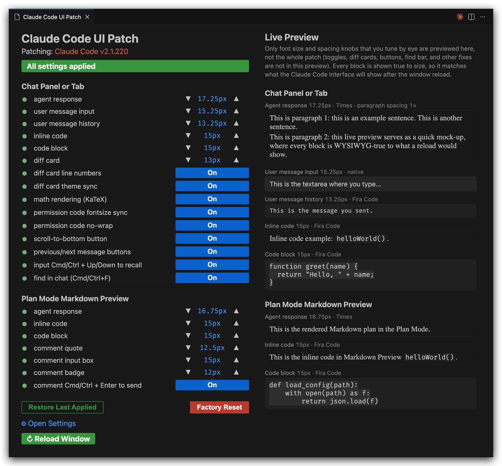
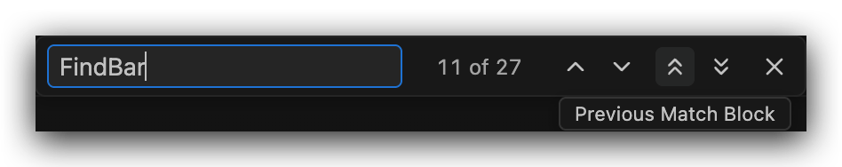
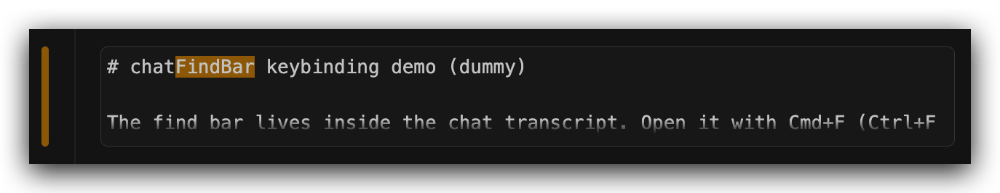

# Claude Code UI Patch

[](https://marketplace.visualstudio.com/items?itemName=zeyutang.claude-code-ui-patch)
[](https://marketplace.visualstudio.com/items?itemName=zeyutang.claude-code-ui-patch)
[](https://open-vsx.org/extension/zeyutang/claude-code-ui-patch)
[](https://open-vsx.org/extension/zeyutang/claude-code-ui-patch)

Patch Claude Code VS Code extension UI to provide finegrained settings for various UI details (font sizes, code blocks, diff cards, and more).

|               Configuration Panel + Live Preview                |
| :-------------------------------------------------------------: |
|  |

|      Previous and Next Turn, Scroll to Bottom      |
| :------------------------------------------------: |
|  |

|              Find Bar               |              Status Bar Icon               |
| :---------------------------------: | :----------------------------------------: |
|  |  |

|            Find Bar: Match and Match Block            |
| :---------------------------------------------------: |
|  |

## What This Extension Patches

Settings live under the `claudeCodeUiPatch.*` namespace (prefix omitted below) and each defaults to Claude Code's native value.
The tree shows every knob, what it targets, and what scales with what: an indented child follows its parent until you give it a value.
The one exception is the "Always applied" group at the end, which has no setting: it fills in UI the native interface applies everywhere except one spot, so installing the patch is the opt-in and uninstalling it is the undo.

```text
chat.fontSize & chat.fontFamily        # native VS Code settings, shared by every chat extension
   │                                   # therefore, this patch does NOT override them
   ├── input box
   ├── interface chrome (buttons, headers, token counts)
   ├── user messages + attachment chips (text font: see chatInputHistoryFontFamily)
   └── other chat extensions (Codex, Copilot, ...)

Chat Panel and Tab                     # chat history only, private to Claude Code
   ├── chatHistoryFontSize             # agent message text, 0 -> follows chat.fontSize
   ├── chatHistoryFontFamily           # agent message font, empty -> native UI font
   ├── chatHistoryBoldWeight           # weight of bold text in agent messages, 0 -> native (700)
   ├── chatHistoryParagraphSpacing     # visible gap between agent paragraphs, 1.0 = native
   ├── chatInputHistoryFontSize        # sent user message text, 0 -> follows chat.fontSize
   ├── chatInputHistoryFontFamily      # sent user message font, empty -> native chat font
   ├── chatCodeBlockFontSize           # fenced code blocks
   │      └── chatCodeInlineFontSize   # inline code, 0 -> follows chatCodeBlockFontSize
   ├── chatMathRendering               # TeX math via bundled KaTeX if On
   │      └── chatMathFontSizeEm       # math size in em of chat text, 1.0 = match (KaTeX stock 1.21)
   └── diff cards                      # Edit / MultiEdit tool cards + expand modal
          ├── chatDiffCardFontSize     # diff code size
          ├── chatDiffCardLineNumbers  # true file line numbers (when known) if On
          └── chatDiffCardThemeSync    # follow VS Code light/dark theme if On
                                       #   (Claude Code 2.1.267+ does this itself)

Plan Mode Markdown Preview
   ├── planPreviewFontSize             # preview text (headings scale with it)
   ├── planPreviewFontFamily           # preview font, empty -> native
   ├── planPreviewCodeBlockFontSize    # fenced code blocks
   │      └── planPreviewCodeInlineFontSize      # 0 -> follows planPreviewCodeBlockFontSize
   └── select-and-comment UI
          ├── planPreviewCommentInputFontSize    # comment box text
          ├── planPreviewCommentInputRows        # comment box height in rows, 0 -> native
          ├── planPreviewCommentQuoteFontSize    # selected-text quote
          └── planPreviewCommentBadgeFontSize    # comment badge (14px circle, keep <= 12)

Behavior
   ├── chatFindBar                     # working Cmd/Ctrl+F find bar in the chat, if On
   │      ├── chatFindBar{Next,Previous}MatchKeys       # extra match chords, comma-separated
   │      └── chatFindBar{Next,Previous}MatchBlockKeys  # block-skip chords atop Cmd/Ctrl+(Shift+)Enter
   ├── chatInputCtrlUpDownToHistory    # recall sent messages via Cmd/Ctrl+Up/Down only, if On
   ├── chatInputMaxLines               # input box: grow to N lines + keep bottom gap, 0 -> native
   ├── chatPopupInputMaxLines          # question "Other" + permission box: N lines, 0 -> native
   ├── chatJumpToMessageButtons        # prev/next above input/permission box: jump turns, if On
   ├── chatRawMarkdownButton           # response hover button: show its markdown source, if On
   ├── chatScrollToBottomDot           # button above input/permission box: scroll to newest, if On
   │                                   #   also auto-scrolls on a permission/question box only when
   │                                   #   already at the bottom, then follows the box as it settles
   │                                   #   (either button On: a question box dims the history like a
   │                                   #   permission box, and an open find bar lifts the dim)
   ├── chatShowMoreAndLessAlign        # "left" / "right", empty "" -> native
   ├── chatPermissionCodeMatchChatCodeBlock      # chatCodeBlockFontSize (On) or chat.fontSize (Off)
   ├── chatPermissionCodeNoWrap        # permission cmd: no-wrap + h-scroll (On) or wrap (Off)
   ├── effortSyncFix                   # push persisted effort level to a reloaded session if On
   ├── planPreviewCommentInputCtrlEnterToSend  # Cmd/Ctrl+Enter sends, plain Enter newlines if On
   └── useCtrlEnterToSendEverywhere    # native useCtrlEnterToSend reaches the question "Other" box,
                                       #   permission feedback box, and plan comment box if On

Always applied                         # no setting; installing this patch is the opt-in
   ├── permission focus ring           # focused permission/question box gets the input box's ring
   └── question answer box reveal      # typing keeps the "Other" box's border and padding in view

Unified codeFontFamily                 # code font only; IN/OUT block, chrome, diff cards stay native
   ├── chat panel and tab  (fenced code + inline code)
   ├── plan mode preview   (fenced code + inline code)
   └── permission prompt   (command block)
```

## Using This UI Patch

### VS Code

Install from the **VS Code Marketplace**: [Claude Code UI Patch](https://marketplace.visualstudio.com/items?itemName=zeyutang.claude-code-ui-patch)

### VSCodium, Cursor, Windsurf, and other forks

Install from the **Open VSX Registry**: [Claude Code UI Patch](https://open-vsx.org/extension/zeyutang/claude-code-ui-patch)

### Get Claude Code patched

- **Panel controls:** Press `Cmd+Shift+P` / `Ctrl+Shift+P` (or `F1`) to open the Command Palette, then run **Claude Code UI Patch: Open Panel**. Or alternatively, click the `aA` item at the far right of the status bar.
  Use `▼`/`▲`, toggles an On/Off switch, and each row's sync dot shows green (in effect), yellow (restart needed), or red (unavailable on this Claude Code version).
  When changes are pending, the header banner turns amber and becomes the apply button, labelled with the lightest restart that will do: **Refresh Webviews** for chat changes (your Claude Code session stays up), **Restart Extensions** when a Plan Mode Preview change needs a fresh extension host, or **Reload Window** when neither is safe.
- **Direct edits:** Font families, the math size (`chatMathFontSizeEm`), the input-box line cap, comment-box rows, and the "Show more/less" button alignment have no panel control, set them in VS Code Settings via direct edits. `claudeCodeUiPatch.*` settings apply on the next restart the banner offers.

## Caveats

- **The patch reverts when Claude Code updates.**
  The next window reload re-applies it and prompts for one more restart.
  Right after an update that is always **Reload Window**: until the window re-scans its extensions, restarting the extension host alone would relaunch Claude Code from the version directory it has just replaced.
- **`chatDiffCardLineNumbers` shows true file positions for live-session edits only.**
  Cards replayed from history (reload, resume), failed edits, and `replace_all` edits number from 1 (Claude Code re-emits conversation history without the absolute line numbers).
- **`chatHistoryBoldWeight` applies to bold runs, not headings.**
  Headings keep their own size-based hierarchy.
  A font with no cut at the weight you pick falls back to its nearest one, so which step changes anything depends on the family: Charter, for instance, goes from 700 straight to its 900 Black.
- **`chatHistoryFontSize` / `chatHistoryFontFamily` restyle the agent transcript only** (by design).
  The input box, interface, and other chat extensions follow the native `chat.fontSize` / `chat.fontFamily`.
  Your own sent messages are styled by `chatInputHistoryFontSize` / `chatInputHistoryFontFamily`.
- **`chatMathRendering` bundles KaTeX into the chat webview** (MIT code, SIL OFL 1.1 fonts; licenses ship in `assets/katex/`) and removes it fully when the toggle turns off.
  Rendering covers the chat only: the Plan Mode preview's content-security policy allows no font loading.
- **`chatRawMarkdownButton` reveals the source of agent responses only.**
  The button rides the response's right edge: at the block's top-right corner while that corner is in view, then pinned just under the user message stuck to the top of the chat, so a long response keeps it within reach.
  Thinking blocks, tool output, compact summaries, and slash-command results render through the same markdown component but get no button.
  Each response switches on its own, and all of them are back to rendered after a webview reload.
- **`chatFindBar` replaces native `Cmd`/`Ctrl`+`F` widget inside the chat webview** (tab and sidebar alike).
